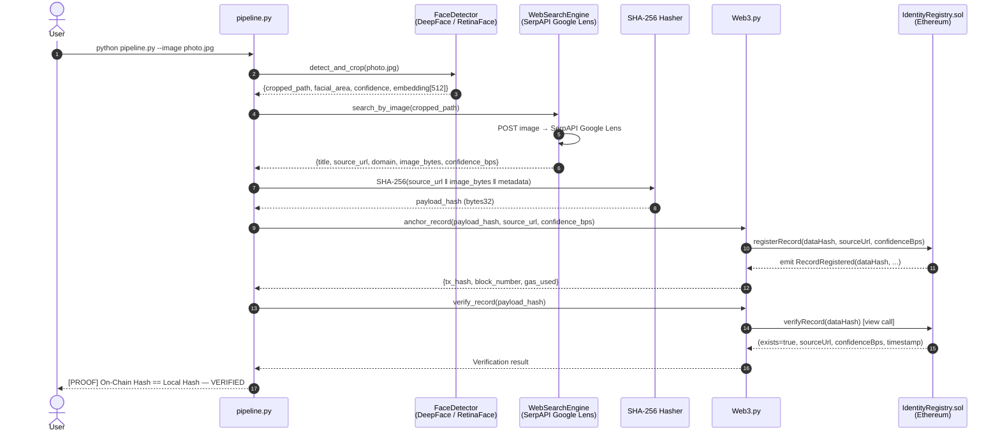

# Face Identification & Blockchain Verification Pipeline
### HH Goa 2026 · Task 3


> **Detect a face. Search the open web. Anchor the proof immutably on-chain.**
> A production-grade Python pipeline that transforms a single photograph into a cryptographically signed, tamper-evident identity record stored on Ethereum.

---

## Table of Contents

1. [Overview](#overview)
2. [Architecture & Data Flow](#architecture--data-flow)
3. [Tech Stack](#tech-stack)
4. [Quickstart Guide](#quickstart-guide)
5. [Module Reference](#module-reference)
6. [Blockchain & Cryptographic Security Model](#blockchain--cryptographic-security-model)
7. [Engineering Maturity & Known Limitations](#engineering-maturity--known-limitations)
8. [Future Work](#future-work)

---

## Overview

This pipeline solves a hard real-world problem in three automated stages:

| Stage | Module | What happens |
|---|---|---|
| **1 · Face Extraction** | `modules/face_detector.py` | RetinaFace locates the primary face, crops it with 20% padding, and extracts a 512-d Facenet embedding |
| **2 · OSINT Identification** | `modules/web_search.py` | The cropped face is submitted to SerpAPI Google Lens; top results are ranked by social-domain priority; the matched page URL and thumbnail are captured |
| **3 · Blockchain Anchoring** | `modules/blockchain.py` | A SHA-256 fingerprint of `(source_url ‖ thumbnail_bytes ‖ metadata)` is submitted to a Solidity smart contract on Ethereum; the record is immutable and publicly verifiable |

A fourth **Verification Stage** immediately re-reads the on-chain record and compares the local hash, producing cryptographic proof that the anchored record is uncorrupted.

---

## Architecture & Data Flow



---

## Tech Stack

| Component | Technology | Version | Role |
|---|---|---|---|
| **Face Detection** | DeepFace + RetinaFace | `0.0.93` | Facial landmark detection, 512-d Facenet embedding |
| **Fallback Detector** | OpenCV Haar Cascade | `4.9.0.80` | Air-gapped / offline fallback |
| **OSINT Search** | SerpAPI Google Lens | API v1 | Reverse image search, social-domain identification |
| **Hashing** | Python `hashlib` SHA-256 | stdlib | Off-chain payload fingerprinting |
| **Smart Contract** | Solidity | `0.8.24` | Immutable on-chain identity registry |
| **Web3 Client** | Web3.py | `6.20.1` | Transaction signing, contract interaction |
| **Local EVM** | py-evm + eth-tester | `0.10.0b4` | Zero-cost in-process demo blockchain |
| **Testnet** | Sepolia (Ethereum) | — | Public tamper-evident ledger |
| **CLI / UX** | Rich | `13.7.1` | Spinners, styled panels, tables, proof display |
| **Compiler** | py-solc-x (solc 0.8.24) | auto | Inline Solidity compilation |

---

## Quickstart Guide

### Prerequisites

- Python **3.10+**
- `pip`
- A free [SerpAPI](https://serpapi.com/) account (100 free searches/month)
- *(Optional)* Infura / Alchemy project ID for Sepolia testnet

---

### Quickstart with Docker

For a fast, isolated setup without installing dependencies locally, use Docker:

```bash
docker build -t face-id .
docker run face-id
```

---

### 1 · Clone & Install

```bash
git clone https://github.com/youruser/task3.git
cd task3

pip install -r requirements.txt
pip install py-solc-x          # Solidity compiler wrapper (auto-downloads solc)
```

---

### 2 · Configure Environment

```bash
cp .env.example .env
```

Open `.env` and fill in:

```ini
# Required — get yours free at https://serpapi.com/
SERPAPI_KEY=your_serpapi_key_here

# Optional — leave as "evm://" for zero-cost local demo
# For Sepolia: https://sepolia.infura.io/v3/<PROJECT_ID>
WEB3_PROVIDER_URI=evm://

# Optional — leave blank for auto-generated local account
PRIVATE_KEY=

# Auto-populated by deploy.py — do not edit manually
CONTRACT_ADDRESS=
```

---

### 3 · Deploy the Smart Contract

```bash
python deploy.py
```

Output:

```
  Compiling  contracts/IdentityRegistry.sol ...
  Compiled ✓   ABI entries: 6   Bytecode size: 847 bytes
  Connected ✓  chainId=131277322940537  block=0

  ┌─────────────────────────────────────────────────────────────┐
  │  Contract:   IdentityRegistry                               │
  │  Address:    0x5FbDB2315678afecb367f032d93F642f64180aa3     │
  │  Gas Used:   287,431                                        │
  │  Elapsed:    124.3 ms                                       │
  └─────────────────────────────────────────────────────────────┘
```

The ABI and deployed address are automatically saved to:
- `contracts/IdentityRegistry_artifacts.json`
- `.env` → `CONTRACT_ADDRESS`

---

### 4 · Run the Pipeline

**Full live mode** (requires `SERPAPI_KEY` and a deployed contract):

```bash
python pipeline.py --image inputs/sample.jpg --top-n 5
```

**Offline demo / screen recording** (no API keys, no network):

```bash
python pipeline.py --image inputs/sample.jpg --offline-mock
```

**Custom Sepolia testnet**:

```bash
python pipeline.py \
  --image inputs/sample.jpg \
  --rpc https://sepolia.infura.io/v3/<PROJECT_ID>
```

**Available flags**:

| Flag | Default | Description |
|---|---|---|
| `--image` | *(required)* | Path to input image (JPG / PNG) |
| `--top-n` | `5` | Max OSINT candidates to evaluate |
| `--rpc` | `WEB3_PROVIDER_URI` env | Web3 RPC endpoint override |
| `--offline-mock` | `false` | Bypass all external calls for demo |
| `--detector` | `retinaface` | DeepFace detector backend |
| `--model` | `Facenet512` | DeepFace embedding model |

---

### 5 · Standalone Module Tests

```bash
# Face detector smoke test
python modules/face_detector.py inputs/sample.jpg

# Web search smoke test (needs SERPAPI_KEY)
python modules/web_search.py inputs/target_cropped.jpg

# Blockchain smoke test (deploys in-process + anchor + verify + duplicate rejection)
python modules/blockchain.py
```

---

## Module Reference

```
task3/
├── contracts/
│   ├── IdentityRegistry.sol              Solidity registry contract
│   └── IdentityRegistry_artifacts.json  ABI + bytecode + deployed address
├── modules/
│   ├── face_detector.py   FaceDetector class  (Stage 1)
│   ├── web_search.py      WebSearchEngine     (Stage 2)
│   └── blockchain.py      BlockchainAnchor    (Stage 3)
├── inputs/
│   └── target_cropped.jpg  Auto-generated face crop
├── pipeline.py            Main CLI entry-point (all 4 stages)
├── deploy.py              Contract compilation & deployment
├── requirements.txt       Locked Python dependencies
└── .env.example           Environment variable template
```

---

## Blockchain & Cryptographic Security Model

### Why hash off-chain?

Storing raw biometric data on-chain would be:

1. **Prohibitively expensive** — a 512-d float embedding is ~4 KB; at Ethereum gas prices that is hundreds of dollars per record.
2. **Slow** — every byte written to `SSTORE` costs gas; block time adds latency.
3. **Privacy-violating** — biometric data must be treated as PII; on-chain storage is permanent and public.

Instead, we compute a **SHA-256 fingerprint** of the detection payload off-chain and store only the 32-byte `bytes32` hash on-chain. This gives us:

- **Integrity**: any change to the source URL or thumbnail invalidates the hash.
- **Non-repudiation**: the block timestamp proves *when* the identification was made.
- **Gas efficiency**: a single `SSTORE` of 32 bytes costs ~20,000 gas (~$0.004 on Sepolia).

### Smart Contract: `IdentityRegistry.sol`

```
mapping(bytes32 => Record) public records
```

| Function | Type | Description |
|---|---|---|
| `registerRecord(dataHash, sourceUrl, confidenceBps, metadataURI)` | `external` | Anchor a new record; reverts on duplicate |
| `batchRegister(dataHashes[], sourceUrls[], confidenceBps[], metadataURIs[])` | `external` | Batch anchor multiple records efficiently in a single transaction |
| `verifyRecord(dataHash)` | `external view` | Read-only verification; zero gas cost |

**Duplicate prevention**: `require(!records[dataHash].exists)` ensures that each unique payload hash can only be registered once, making the ledger **append-only** and **tamper-evident**. The `batchRegister` function gracefully skips duplicates to prevent reverting the entire batch.

**Event**: `RecordRegistered(indexed bytes32 dataHash, string sourceUrl, uint16 confidenceBps, uint256 timestamp)` — enables off-chain listeners and block explorers to index all anchored records.

### Hash Construction

```python
h = SHA-256()
h.update(source_url.encode("utf-8"))
h.update(thumbnail_image_bytes)
h.update(json.dumps({"title": ..., "domain": ...}, sort_keys=True).encode())
payload_hash: bytes32 = h.digest()
```

The hash is **deterministic** — given the same URL, image, and metadata, any party can independently reproduce and verify it without the original face image.

---

## Engineering Maturity & Known Limitations

### What works well

- **DeepFace / RetinaFace** delivers state-of-the-art face detection with automatic OpenCV fallback for air-gapped environments.
- **Priority-domain scoring** surfaces LinkedIn, X, GitHub, and Wikipedia results before generic web hits.
- **py-evm** provides a zero-cost, zero-latency local chain so the full pipeline can be demoed without testnet funds or a network connection.
- **Duplicate guard** at both Python level (`verify_record` pre-flight) and Solidity level (`require(!exists)`) ensures idempotency.

### Known limitations

| Limitation | Impact | Mitigation |
|---|---|---|
| **SerpAPI rate limit** | 100 free searches/month; shared-key exhaustion | Use `--offline-mock` for demos; upgrade plan for production |
| **Face recognition accuracy** | Identical twins, heavy makeup, low-res images reduce accuracy | Add liveness detection; require minimum crop resolution |
| **OSINT coverage** | Subjects without a public web presence return no matches | Expand to Bing Visual Search, PimEyes, or dedicated face-search APIs |
| **On-chain privacy** | `sourceUrl` and `confidenceBps` are publicly readable on testnet/mainnet | Encrypt fields or move to a permissioned chain |
| **No access control** | Any address can register any hash | Add `onlyOwner` or role-based access to `registerRecord` |
| **Gas on mainnet** | ~20,000 gas per record; affordable on L2 but costly on L1 | Deploy to Polygon, Arbitrum, or Base |

---

## Future Work

### Zero-Knowledge Biometric Verification

The most significant privacy upgrade is replacing raw SHA-256 hashing with a **zk-SNARK circuit** (e.g., via [Circom](https://docs.circom.io/) + [snarkjs](https://github.com/iden3/snarkjs)):

```
Prover (local machine):
  witness = (face_embedding, source_url, threshold)
  proof   = zk_prove(circuit, witness)
  public_inputs = {commitment, confidence_above_threshold: bool}

Verifier (smart contract):
  require(zk_verify(proof, public_inputs))
  → records the commitment — never sees the raw embedding
```

This would allow **on-chain verification of identity claims without revealing biometric data** — the holy grail of privacy-preserving identity.

### Other Roadmap Items

- [ ] **Multi-face support** — process group photos and anchor each face independently
- [ ] **Liveness detection** — prevent spoofing with printed photos (blink detection, depth map)
- [ ] **IPFS storage** — pin the face crop to IPFS and store the CID alongside the hash
- [ ] **ENS / DID integration** — link verified identities to Ethereum Name Service or W3C DIDs
- [ ] **REST API wrapper** — expose the pipeline as a FastAPI service for integration

---

## License

MIT — free to use, modify, and distribute.

---

*Built with 💙 for HH Goa 2026 · Task 3*
